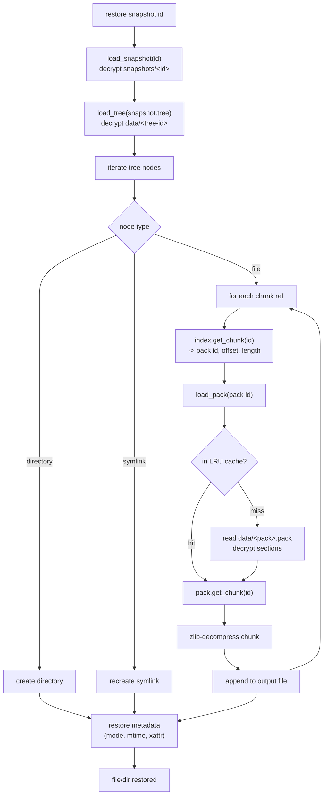

# Backup and Restore Flow

This document traces the end-to-end backup and restore pipelines as implemented
in `core/src/repository.rs` and `cli/src/commands/backup.rs`.

## Backup Pipeline

The backup command opens the repository, acquires an exclusive lock (local
repositories only), walks the source paths, and processes each file through the
chunker. New chunks are added to the current pack; full packs (64MB target) are
flushed to storage and their chunk locations recorded in the index. Finally the
tree, snapshot, and index are written.

```mermaid
sequenceDiagram
    participant CLI as backup command
    participant Repo as Repository
    participant Chunker as Chunker (FastCDC)
    participant Index as Index (bloom + map)
    participant Packer as PackManager
    participant Store as RepositoryStorage

    CLI->>Repo: open_at_location(location, password)
    Repo->>Store: read("config"), read keys
    Repo->>Index: load index/main.idx (decrypt)
    CLI->>Store: acquire exclusive lock (local only)

    loop for each scanned file
        CLI->>Chunker: chunk_data(file bytes)
        Chunker-->>CLI: chunks (BLAKE3 id each)
        loop for each chunk
            CLI->>Repo: has_chunk(chunk_id)
            Repo->>Index: bloom check, then map lookup
            alt chunk is new
                CLI->>Packer: add_chunk(id, data)
                Note over Packer: zlib-compress chunk into current pack
                opt pack reached 64MB
                    Packer-->>CLI: finished pack
                    CLI->>Repo: save_pack(pack)
                    Repo->>Store: write data/&lt;pack&gt;.pack (encrypted)
                    CLI->>Repo: save_chunk_location(id, pack, offset, len)
                    Repo->>Index: add_chunk(...)
                end
            else chunk already exists
                Note over CLI: deduplicated, skip storage
            end
        end
    end

    CLI->>Repo: save_pack(final pack) + locations
    CLI->>Repo: save_tree(tree)
    Repo->>Store: write data/&lt;tree-id&gt; (encrypted)
    CLI->>Repo: save_snapshot(snapshot)
    Repo->>Store: write snapshots/&lt;id&gt; (encrypted)
    CLI->>Repo: save_index()
    Repo->>Store: write index/main.idx (encrypted)
```

Key implementation details verified in the source:

- Deduplication uses the in-memory `Index` (`has_chunk`), which checks the bloom
  filter first and only consults the `HashMap` on a possible hit.
- Each chunk is zlib-compressed (`flate2`) as it is appended to a pack; the pack
  sections are then encrypted with ChaCha20-Poly1305 when written.
- The pack target size in the backup command is 64MB
  (`PackManager::new(64 * 1024 * 1024)`).
- Trees and snapshots are serialized to JSON and encrypted before storage.

## Restore Pipeline

Restore loads a snapshot, reads its tree, and for each file looks up every
referenced chunk in the index, reads the owning pack (through an LRU cache),
decrypts and decompresses the chunk, and reassembles the file.



Key implementation details verified in the source:

- `Repository::load_chunk` resolves a chunk by looking up its `ChunkLocation`
  in the index, then loading the owning pack and calling `pack.get_chunk`.
- `load_pack` consults an LRU cache (`DEFAULT_PACK_CACHE_SIZE` = 128MB, up to
  `DEFAULT_PACK_CACHE_COUNT` = 32 packs) before reading from storage, evicting
  least-recently-used packs when the size budget is exceeded.
- `pack.get_chunk` returns the decompressed chunk bytes; pack section decryption
  happens once when the pack is loaded from storage.
