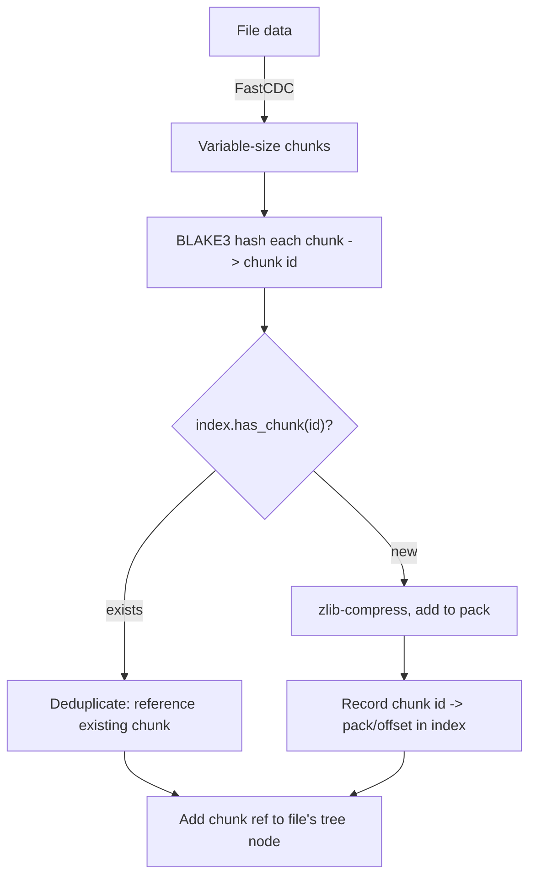

# Content-Defined Chunking

Ghostsnap uses content-defined chunking (CDC) to split files into variable-size chunks for efficient deduplication.

## Why CDC?

Fixed-size chunking breaks files at regular intervals. When data is inserted or deleted, all subsequent chunk boundaries shift, defeating deduplication:

```
Fixed chunking (insert at position 10):
Before: |chunk1|chunk2|chunk3|
After:  |chun|k1chu|nk2ch|unk3|  ← All chunks changed!
```

Content-defined chunking uses file content to determine boundaries. Insertions only affect nearby chunks:

```
CDC (insert at position 10):
Before: |chunk1|chunk2|chunk3|
After:  |chunk1'|chunk2|chunk3|  ← Only chunk1 changed
```

## FastCDC Algorithm

Ghostsnap uses FastCDC, a fast content-defined chunking algorithm:

1. Slide a window over file content
2. Compute rolling hash at each position
3. When hash matches pattern, create chunk boundary

### Parameters

The chunker derives its bounds from the configured average size:
`min = avg / 4` and `max = avg * 4` (`Chunker::new`). The default average is 4MB
(`Chunker::new_default`).

| Parameter | Default | Relationship |
|-----------|---------|--------------|
| Min size | 1MB | `avg / 4` |
| Average size | 4MB | configured target |
| Max size | 16MB | `avg * 4` |

### Boundary Detection

A boundary is created when:

```
hash(window) & mask == pattern
```

Where `mask` is chosen to achieve the target average size.

## Chunk Identification

Each chunk is identified by its BLAKE3 hash:

```rust
chunk_id = BLAKE3::hash(chunk_data)
```

This provides:

- **Deduplication**: Identical content has identical ID
- **Integrity**: Content changes → ID changes
- **Uniqueness**: Collision probability negligible

## Deduplication Flow

The chunker splits file data into variable-size chunks, each identified by its
BLAKE3 hash. For every chunk the backup checks the in-memory index: existing
chunks are skipped, new chunks are compressed and packed.



The existence check (`Repository::has_chunk`) consults the index's bloom filter
first and only falls back to the hash map on a possible hit, so brand-new chunks
are rejected in O(1) without touching storage.

## Deduplication Scenarios

### Identical Files

Two identical files produce identical chunks. Only stored once:

```
file1.txt → [A, B, C]
file2.txt → [A, B, C]  ← Same chunks, no additional storage
```

### Modified Files

Small changes affect only nearby chunks:

```
file.txt (original) → [A, B, C, D, E]
file.txt (edited)   → [A, B', C, D, E]  ← Only B changed
```

### Appended Data

New data at end creates new chunks:

```
file.txt (original) → [A, B, C]
file.txt (appended) → [A, B, C, D]  ← D is new
```

### Inserted Data

Insertion affects local chunks:

```
file.txt (original) → [A, B, C]
file.txt (inserted) → [A, B', B'', C]  ← B split, C unchanged
```

## Performance Considerations

### Chunk Size Trade-offs

| Smaller Chunks | Larger Chunks |
|----------------|---------------|
| Better dedup ratio | Less dedup ratio |
| More index entries | Fewer index entries |
| More pack overhead | Less pack overhead |
| Slower chunking | Faster chunking |

The default 2MB average balances these factors for typical backup workloads.

### Memory Usage

FastCDC processes data in a streaming fashion with minimal memory overhead (window size only).

### Parallelization

Large files can be chunked in parallel by:

1. Splitting file into large segments
2. Chunking segments independently
3. Merging results at segment boundaries
