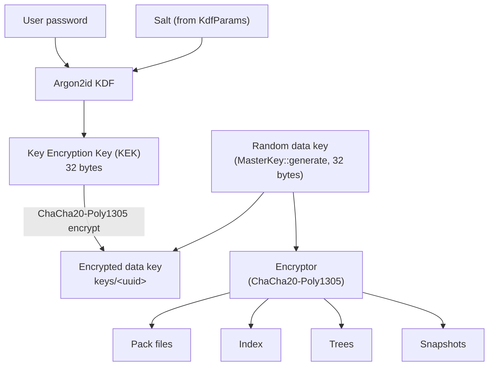
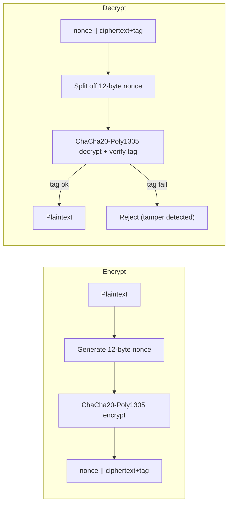

# Encryption

Ghostsnap uses strong encryption to protect all backup data at rest.

## Cryptographic Primitives

| Purpose | Algorithm | Notes |
|---------|-----------|-------|
| Key derivation | Argon2id | Memory-hard, GPU-resistant |
| Symmetric encryption | ChaCha20-Poly1305 | AEAD, fast on all CPUs |
| Hashing | BLAKE3 | Fast, secure, parallelizable |

## Key Hierarchy

The user password is stretched with Argon2id into a key-encryption key (KEK). A
separate random 256-bit data key is generated at repository creation, encrypted
with the KEK, and stored in `keys/<uuid>`. The data key drives a single
`Encryptor` (ChaCha20-Poly1305) used for all repository objects: packs, index,
trees, and snapshots. This indirection means the password can be changed by
re-encrypting only the data key, without rewriting any data.



### Password to KEK

The user password is processed with Argon2id (`Argon2id`, version `0x13`). The
memory, iteration, and parallelism cost parameters and the salt come from the
repository's `KdfParams`, which are stored alongside the encrypted key so the
KEK can be re-derived on open.

### Data Key

A 256-bit random data key is generated at repository creation
(`MasterKey::generate`). It is encrypted with the KEK and written to
`keys/<uuid>` together with the `KdfParams` used to derive the KEK. On open, the
KEK is re-derived from the password and used to decrypt the data key; a failure
to decrypt is reported as an invalid password.

### Single Data Key

All repository objects are encrypted with one `Encryptor` built from the data
key. There are no separate per-domain subkeys; domain separation is provided by
distinct storage paths (`data/`, `index/`, `snapshots/`) rather than distinct
keys.

## Encryption Process

Every encrypted blob follows the same path. The `Encryptor::encrypt` method
generates a fresh 12-byte random nonce, runs ChaCha20-Poly1305, and prepends the
nonce to the AEAD output (ciphertext with the 16-byte Poly1305 tag appended).
Decryption splits the nonce back off and authenticates before returning
plaintext.



### Wire Format

Each encrypted blob is laid out as the nonce followed by the AEAD output, where
the trailing 16 bytes of the ciphertext are the Poly1305 authentication tag:

```
┌────────┬─────────────────────────────────┐
│ nonce  │   ciphertext + Poly1305 tag      │
│ 12 B   │   variable size (tag = last 16 B)│
└────────┴─────────────────────────────────┘
```

### Snapshot and Tree Encryption

Snapshots and trees are serialized to JSON and then encrypted with the data key:

1. Serialize to JSON
2. Encrypt with the data key (ChaCha20-Poly1305)

### Index Encryption

The chunk index is serialized with `postcard` (compact binary) and then
encrypted with the same data key.

## Security Properties

### Confidentiality

- All data encrypted before storage
- Unique nonces prevent pattern analysis
- No plaintext metadata exposed

### Integrity

- Poly1305 authentication tag on all ciphertext
- BLAKE3 chunk IDs verify content
- Tampered data is detected and rejected

### Isolation

- Each repository has a unique, randomly generated data key
- Compromising one repository doesn't affect others

## Threat Model

### Protected Against

- **Storage provider access**: Data is encrypted
- **Offline attacks**: Argon2id resists brute force
- **Tampering**: Authentication tags detect modification
- **Replay attacks**: Unique nonces per encryption

### Not Protected Against

- **Compromised client**: Attacker with access to running ghostsnap
- **Weak passwords**: Use strong, unique passwords
- **Side channels**: Not designed for adversarial environments

## Best Practices

1. **Use strong passwords**: 16+ characters, random
2. **Store password securely**: Password manager recommended
3. **Rotate keys periodically**: Create new repository, migrate data
4. **Secure the client**: Keep systems updated and secure
