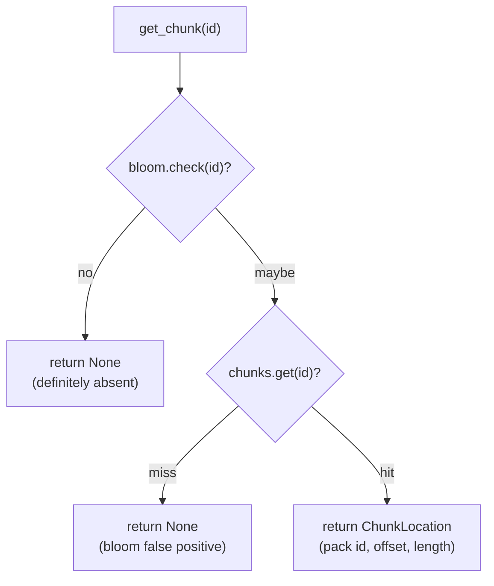
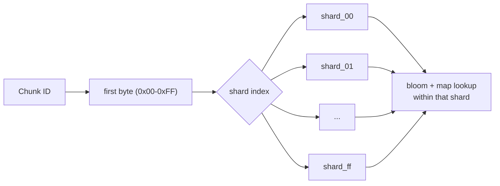

# Chunk Index

The index provides fast lookup of chunks across all packs.

## Purpose

Without an index, finding a chunk requires:

1. List all pack files
2. Read header of each pack
3. Search for chunk ID

With an index:

1. Query index with chunk ID
2. Get pack ID and offset directly

## Index Structure

```
┌─────────────────────────────────────────────────────────┐
│                     Chunk Index                          │
├─────────────────────────────────────────────────────────┤
│ Bloom Filter (fast existence check)                      │
│ ┌─────────────────────────────────────────────────────┐ │
│ │ Bit array for probabilistic membership testing      │ │
│ └─────────────────────────────────────────────────────┘ │
├─────────────────────────────────────────────────────────┤
│ Chunk Map                                                │
│ ┌─────────────────────────────────────────────────────┐ │
│ │ ChunkID → PackLocation                              │ │
│ │   PackLocation {                                     │ │
│ │     pack_id: PackID,                                │ │
│ │     offset: u64,                                     │ │
│ │     compressed_size: u32,                           │ │
│ │     original_size: u32,                             │ │
│ │   }                                                  │ │
│ └─────────────────────────────────────────────────────┘ │
└─────────────────────────────────────────────────────────┘
```

## Bloom Filter

The bloom filter provides fast negative lookups:

- **False positive rate**: ~1%
- **No false negatives**: If bloom says "no", chunk definitely doesn't exist
- **Size**: ~10 bits per chunk

### Lookup Flow

The bloom filter is checked first. A negative result is definitive (no false
negatives), so the lookup returns immediately without touching the hash map. A
positive result is only probable, so the hash map is consulted to confirm and to
fetch the chunk's location.



This optimization is significant during backup when most chunks are new: the
bloom filter rejects them in O(1) before any map lookup or storage access.

## Index Operations

### Add Chunk

```rust
fn add_chunk(&mut self, chunk_id: ChunkID, location: PackLocation) {
    self.bloom_filter.insert(&chunk_id);
    self.chunk_map.insert(chunk_id, location);
}
```

### Lookup Chunk

```rust
fn get_chunk_location(&self, chunk_id: &ChunkID) -> Option<&PackLocation> {
    if !self.bloom_filter.maybe_contains(chunk_id) {
        return None;
    }
    self.chunk_map.get(chunk_id)
}
```

### Remove Chunk

```rust
fn remove_chunk(&mut self, chunk_id: &ChunkID) {
    self.chunk_map.remove(chunk_id);
    // Note: Bloom filter cannot remove entries
    // Rebuild bloom filter during compaction
}
```

## Persistence

The index is persisted as encrypted JSON:

```rust
// Save
let json = serde_json::to_vec(&self.chunk_map)?;
let compressed = zlib::compress(&json)?;
let encrypted = crypto::encrypt(&compressed, &index_key)?;
backend.write("index/chunks.idx", &encrypted)?;

// Load
let encrypted = backend.read("index/chunks.idx")?;
let compressed = crypto::decrypt(&encrypted, &index_key)?;
let json = zlib::decompress(&compressed)?;
let chunk_map = serde_json::from_slice(&json)?;
```

## Index Compaction

Over time, the index accumulates entries for deleted chunks. Compaction removes them:

1. Collect all chunk IDs referenced by snapshots
2. Remove entries not in the set
3. Rebuild bloom filter
4. Save compacted index

```rust
fn compact(&mut self, used_chunks: &HashSet<ChunkID>) -> usize {
    let before = self.chunk_map.len();
    self.chunk_map.retain(|id, _| used_chunks.contains(id));
    let removed = before - self.chunk_map.len();

    self.rebuild_bloom();
    removed
}
```

## Index Sharding

For very large repositories the index can be sharded into 256 shards, one per
value of the first byte of the chunk ID (`should_use_sharding` switches at
1,000,000 chunks). A shared header and pack-metadata file sit alongside the
per-shard files; only non-empty shards are written.

```
index/
├── header.idx       # Sharded index header (version, counts)
├── packs.idx        # Pack metadata shared across shards
├── shard_00.idx     # Chunks whose ID first byte is 0x00
├── shard_01.idx     # Chunks whose ID first byte is 0x01
├── ...
└── shard_ff.idx     # Chunks whose ID first byte is 0xFF
```

A lookup routes straight to the owning shard by the first byte of the chunk ID,
so only that shard's bloom filter and map are consulted.



Benefits:

- **Parallel loading**: Load only needed shards
- **Memory efficiency**: Keep only active shards in memory
- **Faster updates**: Smaller files to rewrite

## Performance

| Operation | Complexity | Notes |
|-----------|------------|-------|
| Lookup (bloom miss) | O(1) | Fast path |
| Lookup (bloom hit) | O(1) | Hash map lookup |
| Insert | O(1) | Amortized |
| Delete | O(1) | Requires compaction for bloom |
| Compaction | O(n) | Where n = index size |

## Memory Usage

Approximate memory per chunk:

- **Chunk ID**: 32 bytes
- **Pack location**: 48 bytes
- **Bloom filter**: ~2 bytes
- **Hash map overhead**: ~16 bytes

Total: ~98 bytes per chunk

For 1 million chunks: ~93 MB
For 10 million chunks: ~930 MB
