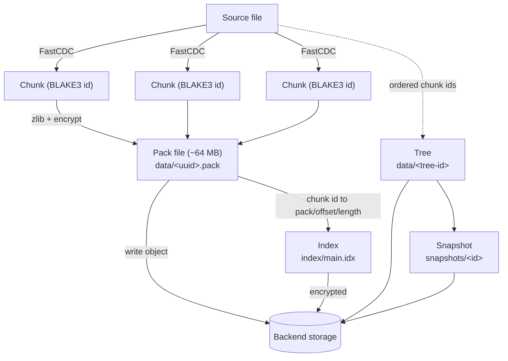
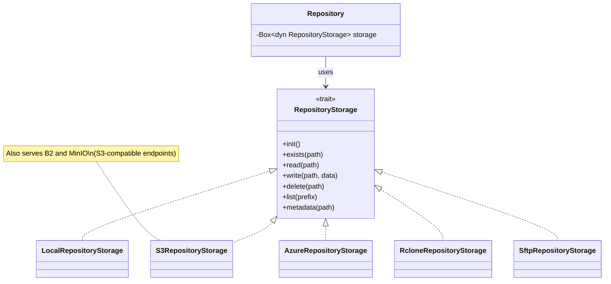

# Architecture Overview

Ghostsnap is a deduplicating, encrypted backup tool written in Rust. This document describes the high-level architecture.

## Core Concepts

### Repository

A repository is the storage location for all backup data. It contains:

```
repository/
├── config          # Repository configuration (JSON)
├── keys/           # Encrypted master keys
├── data/           # Pack files and tree objects
├── index/          # Chunk location index
├── snapshots/      # Snapshot metadata
└── locks/          # Repository locks
```

### Snapshots

A snapshot represents a point-in-time backup. Each snapshot contains:

- **Metadata**: timestamp, hostname, paths, tags
- **Tree**: hierarchical structure of files and directories
- **Chunks**: references to deduplicated data blocks

### Chunks

Files are split into variable-size chunks using content-defined chunking (FastCDC). Each chunk is:

1. Hashed with BLAKE3 for identification
2. Compressed with zlib
3. Encrypted with ChaCha20-Poly1305
4. Stored in pack files

### Packs

Chunks are grouped into pack files (~64MB each) for efficient storage and transfer. Pack files contain:

- Header with chunk count
- Chunk entries (ID, offset, compressed size, original size)
- Encrypted chunk data

## Repository Data Model

The diagram below shows how source data is transformed into the on-disk
repository objects. Files are split into content-defined chunks; chunks are
compressed and packed into pack files; the index records where each chunk lives;
and a snapshot points at a tree that references chunks by ID.



## Data Flow

A detailed step-by-step sequence for both pipelines lives in
[Backup and Restore Flow](backup-flow.md).

### Backup

```
Files → Scan → Chunk → Deduplicate → Compress → Encrypt → Pack → Store
                           ↓
                      Index Lookup
                      (skip existing)
```

1. **Scan**: Walk source paths, collect file metadata
2. **Chunk**: Split files using FastCDC (default 4MB average chunks)
3. **Deduplicate**: Check the in-memory index (bloom filter + map) for existing chunks
4. **Compress**: zlib compression on chunks (per chunk, inside the pack)
5. **Encrypt**: ChaCha20-Poly1305 encryption of the pack sections
6. **Pack**: Group chunks into pack files (64MB target)
7. **Store**: Write to backend storage

### Restore

```
Snapshot → Tree → Chunks → Decrypt → Decompress → Reassemble → Files
                     ↓
                Pack Lookup
```

1. **Load snapshot**: Retrieve snapshot metadata
2. **Walk tree**: Iterate file/directory structure
3. **Fetch chunks**: Load from packs via index
4. **Decrypt**: ChaCha20-Poly1305 decryption
5. **Decompress**: zlib decompression
6. **Reassemble**: Concatenate chunks to files
7. **Restore metadata**: Permissions, timestamps, xattr

## Module Structure

```
ghostsnap/
├── core/           # Core library
│   ├── chunker.rs  # FastCDC implementation
│   ├── crypto.rs   # Encryption/decryption
│   ├── index.rs    # Chunk index with bloom filter
│   ├── lock.rs     # Repository locking
│   ├── pack.rs     # Pack file format
│   ├── repository.rs # Repository management
│   ├── snapshot.rs # Snapshot handling
│   ├── storage.rs  # Storage abstraction
│   └── types.rs    # Shared data types
├── backends/       # Storage backends
│   ├── local.rs    # Local filesystem
│   ├── s3.rs       # Amazon S3
│   ├── azure.rs    # Azure Blob Storage (via azure_simple.rs)
│   └── rclone.rs   # Rclone wrapper (40+ providers)
└── cli/            # Command-line interface
    └── commands/   # Subcommands (backup, restore, etc.)
```

## Storage Backends

Ghostsnap abstracts all object I/O behind the `RepositoryStorage` trait
(`core/src/storage.rs`). The `Repository` holds a single
`Box<dyn RepositoryStorage>` and never touches a concrete backend directly;
`storage_for_location` picks the implementation from the parsed
`RepositoryLocation`.



The `RepositoryStorage` trait exposes a small object-store API
(`init`, `exists`, `read`, `write`, `delete`, `list`, `metadata`):

| Backend | Implementation | Notes |
|---------|----------------|-------|
| Local | `LocalRepositoryStorage` | Direct filesystem access |
| S3 | `S3RepositoryStorage` | AWS SDK; also Backblaze B2 and MinIO via S3-compatible endpoints; SSE support |
| Azure | `AzureRepositoryStorage` | Azure Blob Storage SDK (SAS token or Entra ID) |
| Rclone | `RcloneRepositoryStorage` | CLI wrapper for rclone remotes |
| SFTP | `SftpRepositoryStorage` | SSH/SFTP with host-key verification |

## Design Principles

### Security First

- All data encrypted before leaving memory
- Keys derived with Argon2id
- No plaintext metadata on storage
- Constant-time comparisons where applicable

### Efficiency

- Content-defined chunking for deduplication
- Bloom filter for fast chunk existence checks
- LRU cache for frequently accessed packs
- Parallel processing where possible

### Reliability

- Atomic writes prevent corruption
- Checksums verify data integrity
- Graceful error handling and recovery

### Flexibility

- Multiple storage backends
- Configurable chunk sizes
- Tag-based snapshot organization
