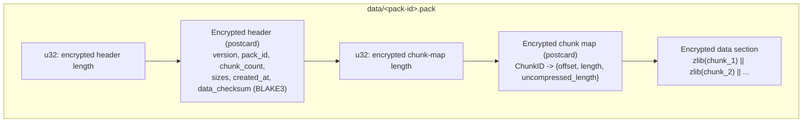

# Pack Files

Chunks are stored in pack files for efficient storage and transfer.

## Why Packs?

Individual chunk storage is inefficient:

- **Many small files**: Overhead per file (metadata, API calls)
- **Transfer overhead**: One request per chunk
- **Storage overhead**: Filesystem block waste

Packs group chunks together:

- **Fewer files**: ~64MB packs instead of ~2MB chunks
- **Batch operations**: One read/write for many chunks
- **Better compression**: Cross-chunk patterns

## Pack Format

A pack file on disk is three length-prefixed, independently encrypted sections:
an encrypted header, an encrypted chunk map, and the encrypted data section. The
header and chunk map are serialized with `postcard`; the data section is the
concatenation of every chunk after individual zlib compression. Each encrypted
section carries its own 12-byte nonce and Poly1305 tag (see
[Encryption](encryption.md)).



The chunk map entries point into the *decrypted* data section: `offset` and
`length` locate a chunk's zlib-compressed bytes, and `uncompressed_length`
records its original size. The header's `data_checksum` is a BLAKE3 hash of the
plaintext data section, checked on read to detect corruption.

## Pack Lifecycle

### Creation

1. Accumulate chunks until target size (64MB), zlib-compressing each chunk as it
   is appended to the data section (`PackFile::add_chunk`)
2. Compute the BLAKE3 checksum of the data section
3. Encrypt the header, chunk map, and data section separately with
   ChaCha20-Poly1305
4. Write the length-prefixed sections to `data/<pack-id>.pack`
5. Update the index with each chunk's location

### Reading

1. Look up chunk in index → pack ID + offset/length
2. Load the pack (from the LRU cache, or read and decrypt from storage)
3. Verify the data-section checksum
4. Slice the chunk's compressed bytes at its offset and zlib-decompress them

### Deletion

Packs are deleted during maintenance:

1. Identify packs with no live chunks
2. Delete pack files
3. Update index

## Pack Manager

The `PackManager` handles pack operations:

```rust
impl PackManager {
    /// Create new pack from chunks
    pub fn create_pack(&self, chunks: Vec<Chunk>) -> Result<PackID>;

    /// Load chunk from pack
    pub fn load_chunk(&self, pack_id: &PackID, chunk_id: &ChunkID) -> Result<Vec<u8>>;

    /// Get pack metadata
    pub fn pack_info(&self, pack_id: &PackID) -> Result<PackInfo>;
}
```

## LRU Cache

Frequently accessed packs are cached in memory:

- **Default size**: 128MB (configurable)
- **Eviction**: Least recently used
- **Hit rate**: Typically 80-95% for restore operations

```rust
// Cache lookup flow
fn load_chunk(&self, pack_id: &PackID, chunk_id: &ChunkID) -> Result<Vec<u8>> {
    // Check cache first
    if let Some(pack) = self.cache.get(pack_id) {
        return pack.get_chunk(chunk_id);
    }

    // Load from storage
    let pack = self.storage.load_pack(pack_id)?;
    let chunk = pack.get_chunk(chunk_id)?;

    // Add to cache
    self.cache.insert(pack_id.clone(), pack);

    Ok(chunk)
}
```

## Repacking

Over time, packs may contain deleted chunks. Repacking consolidates live data:

### When to Repack

- Packs with <50% live data
- After large deletions
- Periodic maintenance

### Repack Process

1. Identify undersized packs
2. Extract live chunks from old packs
3. Create new consolidated packs
4. Update index
5. Delete old packs

```bash
# Manual repack
ghostsnap prune --repack
```

## Pack Sizing

| Scenario | Recommended Size |
|----------|------------------|
| Local storage | 64MB (default) |
| Cloud storage | 64-128MB (reduce API calls) |
| Slow networks | 32MB (faster resume) |
| Large files | 128MB (less overhead) |

## Integrity

Each pack includes integrity checks:

- **Data checksum**: BLAKE3 hash of the plaintext data section, stored in the
  header and verified on read (`verify_checksum`)
- **Encryption tags**: Poly1305 authentication on every encrypted section
- **Chunk IDs**: BLAKE3 hash of content, used to address chunks

Corrupted packs are detected during read and reported as `CorruptedPack`.
